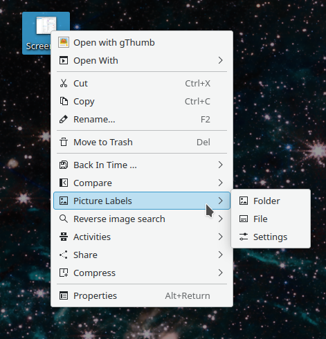
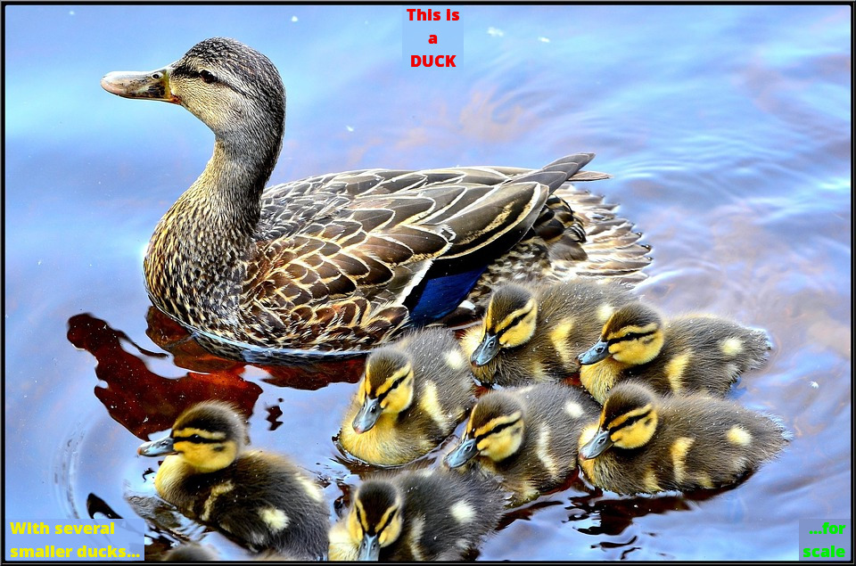
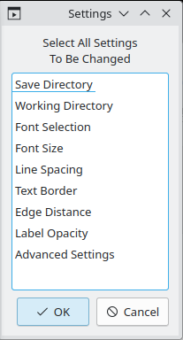

# Picture Labels Service Menu

------

This package adds a context menu to the Plasma desktop for applying labels to existing image files.

The service menu is sensitive to all image types as well as folders so that a folder full of images can quickly be processed to add labels to each image. 

A script is initiated that will guide you through the process with each image, prompting where to place the label(s), the text of the label(s) as well as background color and text color for each location. There can be up to six locations, three along the bottom edge and three along the top edge. Text of the label can be multi-line and the text is justified toward the edge of the image or center justified in the case of the center labels.

Background colors can be picked from the image and a slight transparency is given to them by default to help them appear more integrated. A selection of common text colors are offered, as well as a custom color option where a hex color code can be entered.

After each label is created, a preview of the label is shown on the image before moving on to the next location, and a completed image preview is shown before writing the labeled image to disk and moving on to the next picture. During this process a small text file database is also created to record the text inputs and color choices. These text databases can be reused if there are any changes required after the picture is finalized.

The Settings script provides access to more control over the label details such as font selection, font size, label opacity, and more. Settings is also is where folder locations for the finished images and the database files can be set.

## Requirements

------

The scripts require only common linux command line packages such as:

  * kdialog
  * sed
  * awk
  * imagemagick 

Imagemagick is widely available and often installed by default on many distros. Both legacy IM-6 as well as IM-7 versions are supported. Also supports the flatpak version.

## Installation

------

#### Dolphin

Settings >  Configure Dolphin ... > Context Menu > Download New Services...

Search for Picture Label and use the install button 

Servicemenu should appear in the context menu when right clicking on a folder or image file.

#### Manual

Download the package and run the `install.sh` script. Run `untintall.sh` to remove the service.

May need to check the Dolphin context menu settings to enable [x] the menu in settings.

License 

v3

