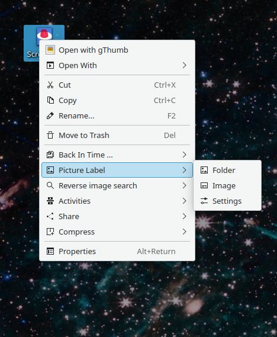
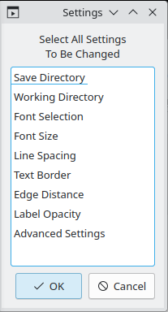
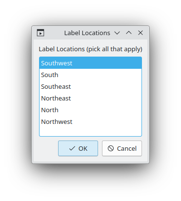
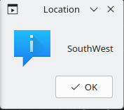
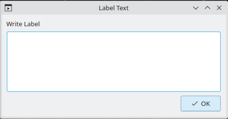
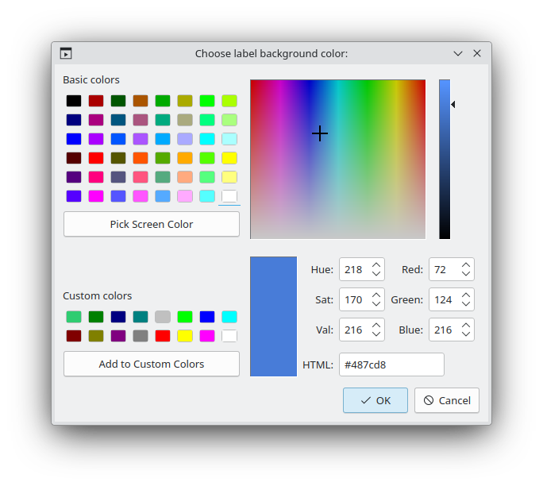
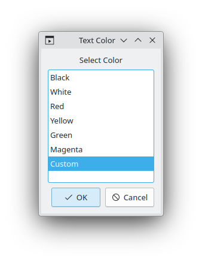
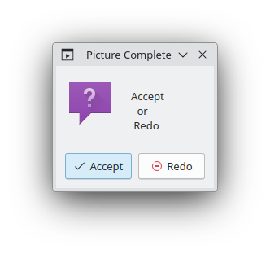

# Picture Label Service Menu

------

This package adds a context menu to the Plasma desktop for applying labels to existing image files.

The service menu is sensitive to all image types as well as folders so that a folder full of images can quickly be processed to add labels to each image, and it guides the user through the labeling process with a copy of each image so that the original image is untouched.

The service prompts for where to place the label(s); the text of the label(s); the background color;  and text color for each location. There can be up to six locations, three along the bottom edge and three along the top edge. Text of each label can be multi-line and the text is justified toward the edge of the image or center justified in the case of the center labels.

Background colors can be picked from the image and a slight transparency is given to them by default to help them appear more integrated with the image. A selection of common text colors are offered, as well as a custom color option where a hex color code can be entered.

After each label is created, a preview of the label is shown on the image before moving on to the next location, and a completed image preview is shown before writing the finished image to the **Save** directory and moving on to the next picture. During this process a small text file database is created in the **Working** directory to record the text inputs and color choices. These text files can be reused if there are any changes required after the picture is finalized. 

The Settings script provides access to more control over the label details such as font selection, font size, label opacity, and much more. Settings also is where **Save** and **Working** directory locations for the finished images and the database text files can be set.

## Usage
------

Right click on a folder or an image file and choose the appropriate menu option for the selection (Folder or Image, respectively).

When Folder is used, the program will cycle through every image file in the folder, one by one, until exhausted or canceled by one of the dialog boxes. When Image is used, the program will just cycle the one image and quit.

For each image displayed, a label location selector is presented for picking where to place the desired label(s). The default is a single label in the SouthWest location (lower left). 

Once the locations are selected, two more dialog boxes appear: 

A message indicating which location is currently in work. This message will remain visible along with the image preview, until the location is accepted as complete. 

A text input dialog for writing (or pasting) the text of the label for this location.

After the text is entered, a color picker for choosing the label background color appears. Choices can be one of the default colors, a custom color, or a screen color from the picture for a color choice that blends perfectly with the surroundings in the picture. The default opacity value is automatically appended to provide a more integrated appearance.

Once the background color is defined, a text color dialog allows selection from predefined colors, or use of a custom color hex code to define the label text color.

The label is now complete and displayed on the updated image, along with this prompt to Accept or Redo the label.  If Accept is selected, work begins on the next label location. If Redo is selected, the label is removed from the image and the process starts over. Fortunately, all the previous inputs are now stored and presented as defaults so that clicking OK will just leave that item unchanged. This allows the user to quickly get to the item that needs changing without disturbing the rest.

This process is repeated for each of the locations until they are all labeled and then another confirmation dialog appears.

The image labeling is now complete and a preview of the final product can be accepted in whole so that  work begins on the next image automatically (if there is one), or the whole labeling process can be started over with the current image (back to the original image). Fortunately, all the previous inputs are now stored and presented as defaults so that clicking OK will just leave that item unchanged. This allows the user to quickly get to the item that needs changing without disturbing the rest.

### Reprocessing

Similarly, entire collections of images can be reprocessed this way as long as the text file database still exists, and the **Working** directory is set to where these files are located via the settings option.

The labeled images are output to the **Save** directory (leaving the originals untouched) as defined in the settings option, the default is the **home** directory for both.

Changes to these directories along with changes to the other settings can be used to create versions of the image labels using different fonts, font size, etc. This can even include different text for the labels, depending  on the user's needs. 

## Requirements

------

The service requires only common linux command line packages such as:
  * awk
  * sed
  * kdialog
  *  imagemagick 

Imagemagick is widely available and often installed by default on many distros. Both legacy IM-6 as well as IM-7 versions are supported. Also supports latest appimage IM-7 version named either the default "imagemagick" or renamed as "magick" if there no other IM-7 installation (recommended).

## Installation
------

#### Dolphin

Settings >  Configure Dolphin ... > Context Menu > Download New Services...

Search for Picture Label and use the install button 

Servicemenu should appear in the context menu when right clicking on a folder or image file.

#### Manual

Download the package to a folder and make the  `install.sh` script executable.

`chmod +x install.sh` 

Then run the  `install.sh` script.

May need to check the Dolphin context menu settings to enable [x] the context menu.

To uninstall repeat the process for the  `untintall.sh` in order to remove the service.

License 

GPL-3.0 

